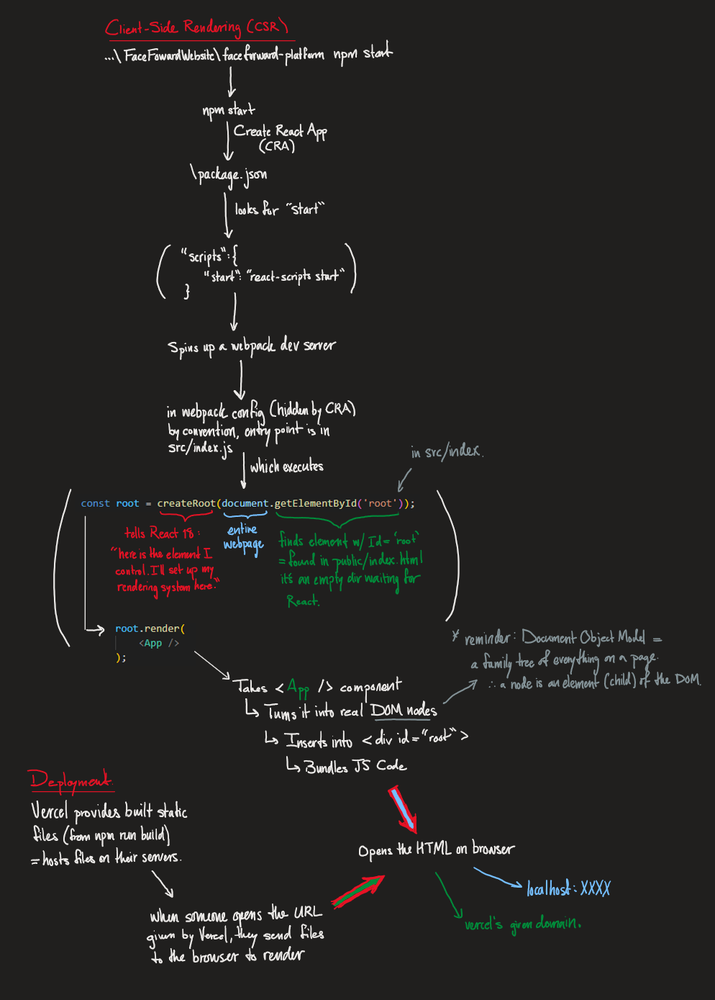

### Introduction/Overview

### Background 
This is my first dynamic website ... I started with static, raw HTML/CSS websites (first resume), then made a few websites with Wix (for non-profits, friends and family), then I created a webiste using React components (my digital portfolio). This website is the natural progression of my web dev journey. I applied my experience and grew by learning the following.

### Process/updates 
I may have been too ambitious with this project as I started copying code from random places - not really understanding how they work. Before this commit I understood ~50% of what was going on. So here I am going to document the challenges I face, how I solve them; as the overall structure of this project (mostly for my understanding...); and (over)annotate the code (as I am not sure if it is truely self documenting). 

#### How React Renders My Website: 

